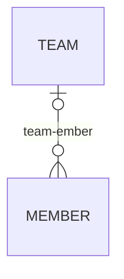

# 5장 연관관계 매핑 기초
@madeBy. hoding  
@reference. [자바 ORM 표준 JPA 프로그래밍](https://product.kyobobook.co.kr/detail/S000000935744?utm_source=google&utm_medium=cpc&utm_campaign=googleSearch&gt_network=g&gt_keyword=&gt_target_id=aud-901091942354:dsa-435935280379&gt_campaign_id=9979905549&gt_adgroup_id=132556570510&gad_source=1&gclid=CjwKCAiA9ourBhAVEiwA3L5RFjIpwY7oZ_U-os5PWYVR4SsArOwzf1q6HIQfzUHm1RK0fd_OYxQgGRoCFK0QAvD_BwE)  
@Date. 23.11.27

### 객체와 관계형 데이터베이스 간에 패러다임 불일치
- 객체는 참졸르 사용해서 관게를 맺는다.
- 테이블은 외래키를 사용해서 관계를 맺는다.
- 방향 : 객체 = 단방향,양방향(단방향 두개), 테이블 = 얍앙향
- 다중성 : 테이블 = N:1, 1:N, 1:1, N;N

### 연관관계 탐색방법
- 객체 그래프 탐색: 객체참조를 이용해서 탐색하는 것
- 조인탐색 : DB join query를 사용해서 탐색하는 것

### 다대일 관계  


#### 관계 매핑
- @ManyToOne
- @OneToMany
- @OneToOne


### 조회
- JPQL
- 객체 그래프

### 수정
- 더디체크 이용
- 연관관계 변경도 동일함 

### 삭제
- 연관관계를 제거하고 삭제해야함
- 그렇지 않으면 외래키 제약족건 오류

### 양방향 연관관계
- 단방향일 때는 참조가 하나여서 해당 참조로 외래키를 관리함
- 양방향 연관관계일 경우 참조가 두개이기 때문에 주인을 지정 해줘야됨
- 연관관계 주인 : 외래키를 관리하는 참조
- 연관관계 주인만 외래키를 관리(C,U,D)할 수 있고 주인이 아님 참조는 읽기만 가능
- 연관관계 주인은 외래키 위치에 따를 것.

#### 객체 관점에서의 양방향 연관관계
- 양방향일때 테이블 관점에서는 중읜말 설정하면 끝남
- 객체관점에서는 양뱡항일때 두개의 참조모두 사용하기 위해서 아래와 같이 연관관계를 설정해야 함
```
#setter
if(this.team != null)
    this.team.getMembers.remove(this) -> 새로운연관관계를 설정할때 기존값을 지워야함
member.setTeam(team) //DB관점 연관관계 설정
team.getMember().add(member) //객체관점 양뱡항 연관관계 설정 -> JPA는 무시
```
- 해당 코드를 setter에 응집시켜 실수를 방지하자.

### 결론
- 양방향의 장점은 객체프로그래밍에서 역방향 객체그래프 탐색이 추가된것
- 단방향 매핑만으로 테이블과 객체의 연관관계 매핑은 이미 완료
- 양방향 연관관계는 객체 양쪽의 참조를 모두 관리해야한다.
- 양방향 연관관계시 toString()등 무한호출 조심


