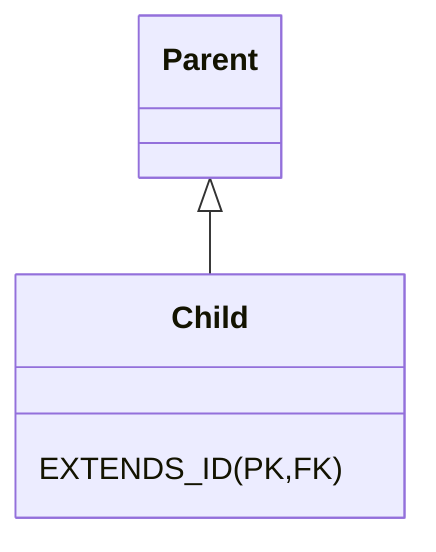

# 7장 고급매핑
@madeBy. hoding  
@reference. [자바 ORM 표준 JPA 프로그래밍](https://product.kyobobook.co.kr/detail/S000000935744?utm_source=google&utm_medium=cpc&utm_campaign=googleSearch&gt_network=g&gt_keyword=&gt_target_id=aud-901091942354:dsa-435935280379&gt_campaign_id=9979905549&gt_adgroup_id=132556570510&gad_source=1&gclid=CjwKCAiA9ourBhAVEiwA3L5RFjIpwY7oZ_U-os5PWYVR4SsArOwzf1q6HIQfzUHm1RK0fd_OYxQgGRoCFK0QAvD_BwE)  
@Date. 23.12.18

---
## 학습목표
- 상속매핑 이해
- @MappedSuperClass 이해
- 복합기 비식별,식별관계 매핑
- 조인테이블 이해

## 상속관계 매핑
#### 3가지 전략
- 조인전략 : 각각의 테이블로 변환하고 조회 시 조인을 사용한다.
- 싱글테이블 전략 : 통합 테이블로 매핑
- 서브타입 테이블로 변환

### 조인전략
- 부모 기본키를 자식테이블이 (PK,FK) 사용하는 전략 (식별관계)

```java
// 자식
@Entity
@DiscriminatorValue(name="M") // 엔티티가 저장될 때 구분 컬럼에 입력할 값
@PrimaryKeyJoinColumn(name = "BOOK_ID") // 상속받은 기본키 이름 재정의
public class ...{}
```
- 장점 : 테이블 정규화, 외래키 활용 가능, 저장공간
- 단점 : 조회시 조인사용, 비교적 쿼리 복잡, insert query 두번남감.

### 단일 테이블 전략
- 구분 칼럼으로만 어떤 자식 데이터가 저장되었는지 구분한다.
```java
//부모
@Entity
@Inheritance(strategy = InheritanceType.SINGLE_TABLE)
@DiscriminatorColumn(name="DTYPE")
public class ...{}
```
```java
//자식
@Entity
@DiscriminatorValue(name="M") 
public class ...{}
```
- 장점 : 일반적으로 전략중 조회가 제일 빠르다. (조인이 없다. 쿼리가 단순하다.)
- 단점 : 자식 엔티티 컬럼이 nullable 하다, 테이블이 커질 수 있고 이때문에 성능저하가 발생할 수 있다.

### Table-per-concreate-class 전략
- 자식 엔티티 마다 테이블을 만들고 팔요한 컬럼을 모두 가진다.
```java
//부모
@Entity
@Inheritance(strategy = InheritanceType.TABLE_PER_CLASS)
public class ...{}
```
```java
//자식
@Entity
public class ...{}
```
- 장점 : not null 제약조건 사용가능
- 단점 : union연산으로 조회하기 때문에 성능 느리다.

## 개인적 결론 : 상속으로 이루고자 하는 목표 중심으로 단일테이블,조인 전략 중 선택하자

## @MappedSuperClass
- 추상 클래스와 비슷
- 매핑정보만 자식클래스에 상속
- 상속받은 매핑정보 재정의 할 수 있음

## 식별관계 / 비식별 관계
- 식별관계 : 부모 테이블의 기본키를 내려받아서 자식테이블의 기본키+외래키로 사용하는 관계
  
- 비 식별관계 : 부모의 기본키를 자식이 PK,FK로 사용
  - 선택적 : 외래키에 null 허용
  - 필수적 : 외래키에 null 불가

  

## 복합키를 사용하는 비식별 관계
- 별도의 식별자 클래스를 생성해야함


#### @IdClass 사용 : DB관점 접근 방식
```java
//부모
@Entity
@IdClass(ParentId.class) //별도의 식별자 클래스를 사용한다.
public class Parent{
        @Id 
        @Colomn(name = "PARENT_ID1") 
        private String id1; // ParentId.id1 연결

        @Id
        @Colomn(name = "PARENT_ID2")
        private String id1; // ParentId.id2 연결
}
```
```java
//별도의 식별자 클래스
public class ParentId implements Serializable {
        private String id1;
        private String id2;
        
        //기본생성자
        //all 생성자.
        //equest,hashCode override
}
```
```java
//자식
public class Child {
    @Id
    private String id;
    
    @ManyToOne
    @JoinColumns({
          @JoinColumn(name = "PARENT_ID1", referencedColumnName = "PARENT_ID1"), //joinColumn 매핑 및 외래키 이름 설정
          @JoinColumn(name = "PARENT_ID2", referencedColumnName = "PARENT_ID2")
    })
    private Parent parent;
}
```

```java
    //사용코드 : 부모 id 할당
    Parent p = new Parent();
    parent.setId("Id1");
    parent.setId("Id2");
    //persist
```
#### @EmbeddedId 사용 : OOP 관점 접근 방식
//자주 사용하는 어노테이션이라 예제는 생략합니다.

## 복합키 다룰 때 주의사항
- 자바는 기본적으로 동일성 비교를 함으로, equals,hashCode를 재정이하여 동등성 비교를 하도록 구성해야함
  - 덧. DB관점에서 동일한 복합키가. 객체로 다뤄지는 java환경에서 레퍼런스 동일성 비교로 같지 않다고 판단될 수 있음

## 식별/비식별 복합키 관련 추가 레퍼런스
[Legacy DB의 JPA Entity Mapping (복합키 매핑 편)](https://techblog.woowahan.com/2595/)
```
요약
이미 식별관계로 DB가 구성되어 있고 복합키가 하나 이상 여러개 있을경우 @EmbeddedId를 사용하면 특정상황에서 객체그래프 탐색이 길어질 수 있음으로
@IdClass로 매핑하여 비즈니스적으로 의미있는 PK 값을 명시적으로 필드를 노출하는 것이 더 좋은 방법일 수 있다.  
```

## 비식별관계
// 자주 사용하는 관계임으로 예제는 생략합니다.

## 일대일 식별관계
- 부모키를 자식테이블에서 기본키 값으로 사용한다.
- @MapsId
```java
@entity
public class Child{
    @Id
    private Long id;
    
    @MapsId // parent 키값만 사용하도록 매핑
    @OneToOne
    @JoinColumn(name = "PARENT_ID")
    private Parent parent;
  
}
```

## 조인테이블
- 연관관계를 테이블을 통해 나타낸다.
#### 연관관계 나타내는 두가지 방법
- 조인컬럼 사용(외래키)
  - 선택적 비식별관계에서 외부조인을 사용해야 한다.
    - 관계맺는 빈도가 적으면 Null 비율이 늘어난다.
- 조인테이블 사용
  - 위 단점이 크리티컬한 이슈로 다가올때 고려대상이다.
```
요약
기본적으로 조인칼럼(외래키) 사용하되. 위에 있는 이슈나 관계에 대하여 추가적인 정보를 관리해야 할때 조인테이블을 사용하면 된다.
다대다를 일대다 다대일로 풀어서 사용할 경우에 조인테이블이 많이 이용된다.
```

## 하나의 엔티티에 여러테이블 매핑하기
```
요약
일대일로 풀어서 사용하는 것이 합리적이다.
해당 기능을 사용하면 조회 최적화가 어렵다
```
`개인생각
비즈니스 적으로 하나에 엔티티로 묶여야 하는 대상은 테이블에서도 묶거나 그렇지 않다면 일대일로 각각을 매핑하는 것이 합리적이라고 생각한다.
DDD : RDBMS 패러다임 차이를 극복하기 위해서 종종 사용 될 것 같다 `