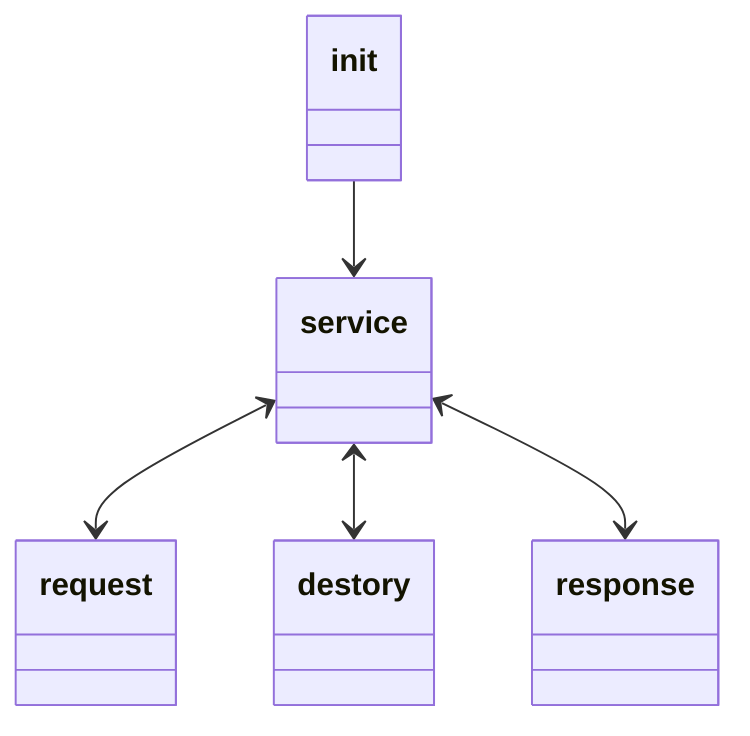

# 5장 스프링부트 애플리케이션 보안
madeBy hoding  
reference [SpringBoot In parctice](https://product.kyobobook.co.kr/detail/S000208713876)  
Date 23.12.12
## 스프링 시큐리티 기본헤더
- cache-control : no-cache ...
  - 브라우저 캐시 빌활성화
- x-content-type-options
  - 브라우저 contentType 추측 비활성화, contetnType헤더로 지정된 contetType만 사용하도록 강제
- strict-transport-security
  - 응답헤더에 포함되면 이후 해당 동메인에 대해서는 브라우저가 자동으로 HTTPS를 통해 연결하도록 강제하는 HSTS활성화
- x-frame-options
  - 값을 Deny로 설정하면 웹페이지 콘텐트가 frame,iframe,embed에서 표시되지 않도록 강제하여 클릭재킹 공격 방지
- X-Xss-protection
  - 값을 1, mode=block으로 설정하면 브라우저의 XSS필터링을 활성화하고 XSS공격이 감지되면 로딩하지 않도록 강제

## 스프링 시큐리티 인증 과정
1. 클라이언트: 인증이 필요한 자원에 접근
2. 서버 : 인증되지 않은 상태 감지
3. 서버 : 로그인 리다이렉트(또는 다른 인증수단)
4. 클라이언트: 로그인정보 임력
5. 클라이언트: 로그인정보 전송
6. 서버 : 인증
7. 서버 : 인증 성공시 -> 접근혀용, 인증 실패시 -> 로그인유도
8. 클라이언트: 로그아웃, 서버: 로그인 화면

## 필터
#### 스프링에서는 HTTP 요청을 디스패처 서블릿이 처리한다. 이때 요청-응답 과정에서 중심을 담당하는 것이 필터다
- 서블릿 앞단에서 요청-응답을 가로채서 변경할 수 있다.
- client <-> filter <-> 디스패처 서블릿
- 스프링 시큐리티는 DelegatingFilterPorxy 필터로 모든 요청을 가로챈다.

## 필터 인터페이스
- init() : 필터 초기화 과정에서 호출된다.
- dofilter(...) : 실질적인 작업수행, 필터체인 객체에 접근가능하다.
- desotry() : 서블릿 컨테이너가 필터를 제거할 때 호출

## 필터 라이프사이클


## 필터체인
- 서블릿 컨테이너가 제공하며 필터들을 연쇄적으로 흘러갇도록 만드는 역할
  
- 출처 : [스프링 공식문서 Spring Security > sevletApplcation > architecture](https://docs.spring.io/spring-security/reference/servlet/architecture.html#servlet-delegatingfilterproxy)
## 필터 인터페이스의 doFilter()
```java
public void doFilter(ServletRequest request,ServeltResponse response ,FilterChain filterChain)
```
- 메소드 안에 필터작업을 완료한 후 필터체인의 메소드를 호출해서 다음필터를 거쳐가게 만들 수 있다.
- 스프링 시큐리티는 보안관련 기능을 구현하기 위해 다양한 필터를 제공한다
  - UsernamePasswordAuthenticationFilter : ID/PW 기반 인증
  - BasicAuthenticationFilter : Http 기본인증
  - ...

## DelegatingFilterProxy, FilterChainProxy
- 두 필터는 HTTP요청이 스프링 시큐리티 인프라스트럭처를 통과하게 만드는 진입점 역할을 한다.

## 스프링 시큐리티 아키텍처
- 필터 인스턴스는 서블릿 컨테이너 컴포넌트이다. 즉 서블릿 컨테이너가 관리한다.
- DelegatingFilterProxy는 서블릿 필터이며 서블릿 컨테이너에 등록되고 라이플사이클도 서블릿이 관리한다.
  - delegate 패턴 : 객체가 자신의 기능을 다른객체에 위임하여 기능을 실행하는 패턴
    
- 출처 : [스프링 공식문서 Spring Security > sevletApplcation > architecture](https://docs.spring.io/spring-security/reference/servlet/architecture.html#servlet-delegatingfilterproxy)
- FilterChainProxy가 위임자가 된다.
- SecurityFilterChaing
  - matchers() : 요청을 처리하는데 적합한지 판별
  - getFilters() : matchers()가 ture를 반환하면 호출되면서 필터체인의 모든 필터를 거친다.

## 사용자 인증

- 출처 : [스프링 공식문서 Spring Security > sevletApplcation > authentication > authentication architecture](https://docs.spring.io/spring-security/reference/servlet/authentication/architecture.html#servlet-authentication-securitycontext)
- SecurityContext : 사용자 이름, 권한 등 식별에 필요한 정보
  - securityContextPersistenceFilter가 관리
    - securityContextRepository에서 context 획득
    - 웹기준 HttpSessionSecuirtyContextRepoisotry구현체가 세션정보를 securityContext에 로딩

## 시큐리티 필터 - 인증과정

- authenticationManager : 실제 인증처리 서비스를 제공하는 provider 목록을 가지고 있다.

## 스프링 시큐리티 자동구성
#### 주요클래스
- securityAutoConfiguration --@Import -> SpringBootWebSecurityConfiguration, WebSecurityEnablerConfiguration, SecurityDataConfiguration
- userDetailsServiceAutoConfiguration
- SecurityFilterAutoConfiguration

## securityAutoConfiguration
- 스프링 시큐리티 중심 클래스
- 3가지 configuration import
1. SpringBootWebSecurityConfiguration
  - 클래스패스에 스프리킹 시큐리티가 있지만 커스텀하지 않았을때 기본인증 SecurityFilterChain Bean을 생성
2. WebSecurityEnablerConfiguration
  - @EnableWebSecurity 존재 : 스프링 시큐리티 활성화
    - @Import webSecuirtyConfiguration : 웹 리소스 보안담당 webSecurity 빈 생성
    - @Import HttpSecurityConfiguration : HTTP 보안담당 HttpSecuirty 빈 생성
  - @EnableGlobalAuthentication 존재 : securityFilterChain에 전역적으로 사용되는 AuthenticationManager를 Builder인스턴스를 통해 사용할 수 있게 설정
3. SecurityDataConfiguration
  - 스프링 시큐리티 - 스프링 데이터 연동에 사용
### 직접 시큐리티 설정 정의하는 법
- webSecurityConfigurerAdapter 상속 또는 webSecurityConfigurer 구현
## userDetailsServiceAutoConfiguration
- userDetailsService 구현체가 빈으로 등록되어 있지 않으면 InmemoryUserDetailsManager 빈 등록
  - 기본 계정 제공, 시작로그에 pw 노출
## SecurityFilterAutoConfiguration
- DelegatingFilterProxyRegistration Bean 생성
  - DelegatingFilterProxy 필터를 생성하고 서블릿 컨테이너에 등록
- SecurityAutoConfiguration 이후에 설정됨

## 스프링 시큐리티 로그인 페이지 변경하기
#### webSecurityConfigurerAdapter 상속
```java
@override
protected void configure(HttpSecuirty http)
```
- http 보안
```java
@override
protected void configure(WebSecuirty web)
```
- 정적자원(이미지,css) 보안

## 인메모리 인증 적용
- 요구사항 : 커스텀 사용자 생성, 비밀번호 암호와, 권한 구현
#### webSecurityConfigurerAdapter 상속
```java
@override
protected void configure(AuthenticationManagerBuiler auth){
        auth.inMemoryAuthentication().paswwwordEncoder(passwordEncoder)
        .withUser("user")
        ...
        // id,pw,role 설장
        }

protected void configure(HttpSecuirty http){
        http ...
        .antMatchars("/~ ").hasRole("ADMIN")
        ...
        .exceptionHandling().accessDeniedHandler(CustomAccessDeniedHandler); //커스텀 예외 핸들러 설정
        }
```
```java
CustomAccessDeniedHandler implements AccessDeniedHandler ->인증실패시 예외 핸들러
```
- 감사목적 로그출력 가능

## PasswordEncoder
- 스프링 시큐리티는 PasswordEncoderFactories로 DelegatingPasswordEncoder를 생성하고 BCrypt,Scrypt 등 실제 암호화 구현체에게 위임하여 사용할 수 있도록 제공한다.

## 사용자 정보를 DB에 저장하고 인증하기
- USER(사용자 정보), AUTHORITIES(권한) 테이블 필요 -> 기본값
```java
@override
protected void configure(AuthenticationManagerBuiler auth){
        auth.jdbcAuthentication().dataSource(dataSource)
        ...
```

## 사용자 정보를 다른 테이블에서 관리하기
- UserDetailsService 구현체를 만든다.
- loadUserByUsername()을 override한다.
  - 사용자 정보를 다루는 entity를 로딩하도록 구성하고 UserDetails객체를 반환한다.
- WebSecurityConfigurerAdapter 상속 클래스에서 커스텀한 UserDetailService구현체를 빈으로 등록한다.

## LDAP(lightweight directory access protocol)
- 조회가 빨라 많은 조직에서 LDAP를 이요한 사용자 관리를 진행한다.
- spring-ladp-core, spring-security-ladp 으존성 필요
- 간단한 내장형 LDAP 서버(UnboundID)
- 사용자 정보를 LDIF(LDAP data intercharge format) 파일에 저장한다.
  - LDIF 구조: dc:.. -> 루트, ou:.. -> 조직, cn:.. -> 사용자 정보
- userDetailsService를 사용할 수 없다.
  - LDAP로부터 비밀번호를 읽어올 수 없고, LDAP에서 비밀번호 일치여부를 담당한다.
  - 인증방식 2가지
    - compare 연산
    - bind 인증