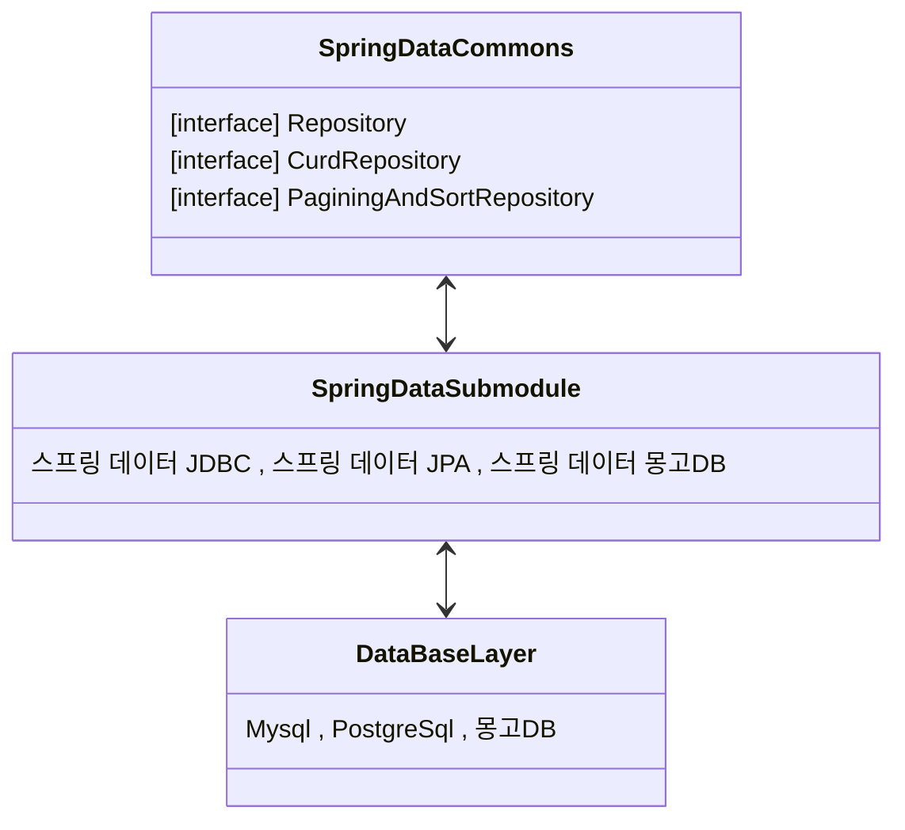
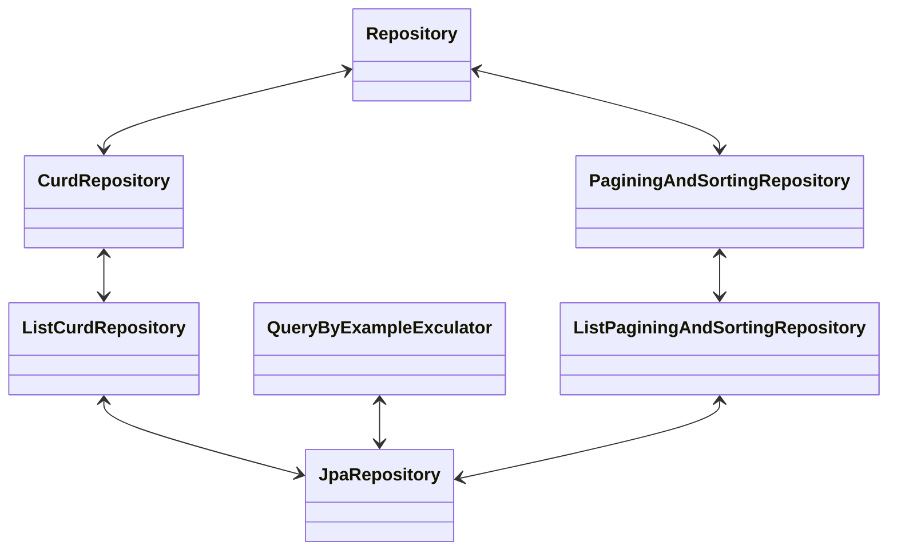

madeBy hoding 
reference [SpringBoot In parctice](https://product.kyobobook.co.kr/detail/S000208713876)
Date 23.11.24

# 스프링 데이터 프로젝트
- 스프링 프레임워크에 속해 있으며 특정 데이터베이스를 대상으로 하는 여러 하위 프로젝트를 포함하고 있는 상위 프로젝트이다.
  - 스프링 데이터 JPA 모듈 -> 관계형 대상
  - 스프링 데이터 MongoDB 모듈 -> 몽고DB 대상  

### JPA
애플리케이션에서 쿼리를 작성, DB 연결, ORM등 편리성을 제공

### 하위 모듈
- srping data commons : 기본 모듈  
이하 특정 DB에 특화된 모듈
- spring data jdbc
- spring data jpa
- spring data mongodb
- spring data redis
- spring data REST
- spring data apache cassandra
- ...


# 스프링 데이터 모듈
- 스프링 데이터 프로젝트에 포함되어있는 하위 프로젝트

### SPRING-DATA commons
- 다른 모듈을 이루는 기초 컴포넌트 모듈


# 히카리 커넥션 풀   
- 스프링 부트는 히카리 커넥션풀을 기본값으로 사용한다.   
- 커넥션풀은 한개 이상의 데이터베이스 연결을 포함하고 있다.    
- 애플리케이션 시작될때 미리 데이터베이스 연결을 생성에서 풀에 넣고 필요할 때 꺼내여 사용한뒤 반납한다.   
- 커넥션 풀 덕분에 쿼리 실행할 때마다 데이터베이스 연결을 생성할 필요가 없고 사용할 삭제할 필요도 없다.  
- spring-boot-starter-data-jpa -> spring-boot-starter-jdbc -> hikariCP  
- 커넥션 풀은 다른걸로 변경할 수 있다.  
- 커넥션 풀의 최대 연결 개수를 지정할 수 있다.  

# 관계형 데이터베이스 초기화 방법  
- DDL : 구조정의 언어    
- DML : 데이터 조작 언어  
- sql 스크립트로 데이터베이스를 초기화 할 수 있다.  

### 설정 방법들
`[application.properties] spring.sql.init.mode=always //기본값이 embedded`   
embedded는 인메모리 DB만 초기화가 실행된다.   

- DDL 스크립트 -> src/resources/ 에 schema.sql 또는 schama-${platform}.sql
- DML 스크립트 ->src/resources/ 에 data.sql 또는 data-${platform}.sql      
  `[application.properties]  spring.datasource.patform=mysql`  
  `[application.properties]  spring.jpa.hibernate.ddl-auto=none`  

### 스크립트 파일 경로 및 이름 직접 지정  

classpath: => src/main/resources
```
[application.properties] spring.sql.init.schema-locations=classpath:sql/schema/sbip_schema.sql
```
- => src/main/resources/sql/schema/ship-schema.sql
 

# 스프링 데이터 모듈의 interface 관계

- Repository<T,ID>  
객체의 런타임 타입정보만을 알려주는 카머 인터페이스  
- CrudRepository<T,ID>  
기본 CURD 메서드 가지고 있다.  
  
### @Repository  
- 자동감지 : @Component 포함   
- 에외변화 : JPA 구현체마다 다른 예외를 스프링의 DataAccessException으로 변환하여 구현체에 독립적으로 예외처리할 수 있게 해준다  

# 커스텀 스프링 데이터 리포지터리 만들기  
- 필요한 CURD만 노출하고 싶을 때  

```
@NoRepositoryBean // 프록시 객체 생성 X -> 자동 구현체 생성 X
public interface BaseRepoisotry<T,ID> extends Repository<T,ID>{
    <S extends T> S save(S entity);
    Iterable<T> findAll()
}
```
```
@Repository
public interface CustomizedCourseRepository extends BaseRepository<T,ID>{}
```

### 참고: Slice test annotation  
- @SpringBootTest : IoC 컨테이너를 뛰우며 Application Context가 생성됨  
- @DataJpaTest : DAO계층과 관련된 빈만 사용할 수 있게 설정해줌  
- @WebMvcTest : Mvc 관련 컴포넌트 테스트 할때  

# 스프링 데이터를 사용한 데이터 조회
1. 쿼리메소드
   - 메소드 이름으로 쿼리
   - @NameQuery
     - Entity와 관련없는 쿼리코드가 Entity 클래스에 존재하는 단점
   - @Query
     - @Modifiying 조회 외의 JPQL을 사용할때 명시해야 한다.
       - 변경된 컬럼 수를 반환한다 (int,Inetger 반환타입일 경우)
     - 타입 안정성과 쿼리 정적검사가 불가능하다.
2. Criteria API
   - 타입 안정성과 쿼리 정적검사가 가능하다.
   - 코드양이 많아지는 단점이 있다.
3. QueryDsl
    - Criteria를 개선한 서드파티 라이브러리
    - 프로젝션
      - 클래스 프로젝션 -> Dto로 프로젝션한다.
      - 인터페이스 프로젝션 -> getter메소드로 프로젝션한다.